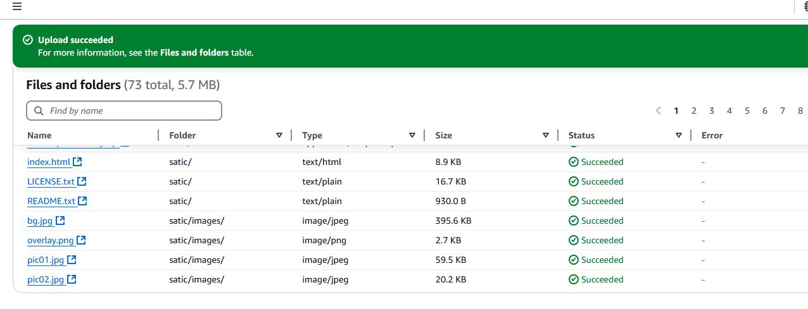
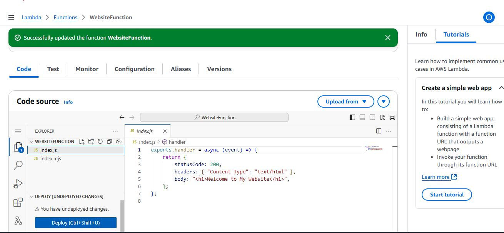

# AWS Critical Thinking Projects 6

## Project Objective: To evaluate AWS Lambda and Elastic Beanstalk as potential hosting solutions for the company's website. Your goal is to deploy the existing website onto both AWS Lambda and Elastic Beanstalk, analyze their performance, scalability, and cost implications, and provide recommendations to the management team based on your findings.

# Step-by-step implementation

# 1. Research and Download a simple Static webiste

# 2. Create and upload the files in an S3 bucket.

# 3. Create an AWS Lambda Function to Serve the Website and upload neccessary files and configure appoprite settings

# 4. Test Your Website

- Open your API Gateway Invoke URL
  
